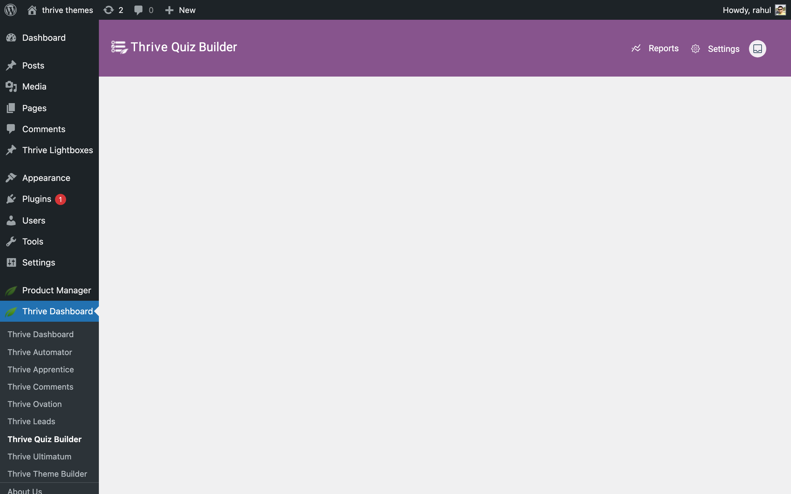

# How to Build Your First Quiz Using Thrive Quiz Builder

In this article, you'll learn how to create, configure, and publish your first quiz using Thrive Quiz Builder. This guide walks you through the initial setup, choosing a style, and displaying the finished quiz on your website.

## Before You Begin

Make sure you have the **Thrive Quiz Builder** plugin installed and activated on your WordPress site.

---

## Step 1: Add a New Quiz

The first step is to create a new quiz container in your dashboard.

1. Navigate to **Thrive Dashboard** > **Thrive Quiz Builder**.
2. Click the **Add New** button.
3. Choose one of the following options:
    * **Build from scratch:** Start with a blank canvas and no pre-defined settings.
    * **List Building:** Pre-configured with an Opt-in Gate to grow your email list.
    * **Social Share:** Optimized for viral sharing with pre-configured social badges.
    * **Gain Customer Insights:** Designed for market research and data collection.
4. Click **Continue**.
5. Give your quiz a **Name** (internal use only) and click **Save**.

---

## Step 2: Choose a Quiz Type

Next, you need to decide how your quiz will evaluate user answers and provide results.

1. In the quiz dashboard, find the **Quiz Type** card and click **Choose Quiz Type**.
2. Select one of the five available types:
    * **Number:** Users earn points for each answer, resulting in a total numeric score.
    * **Percentage:** Results are calculated as a percentage of the maximum possible score.
    * **Category:** Users are assigned to a specific category based on their answers.
    * **Right/Wrong:** Evaluates correct vs. incorrect answers (ideal for knowledge tests).
    * **Survey:** Collects data without assigning a score or category.
3. Once selected, click **Continue**.

---

## Step 3: Choose a Quiz Style

The style determines the look and feel of all the pages in your quiz (Splash Page, Questions, Opt-In Gate, and Results Page).

1. Find the **Quiz Style** card and click **Choose Style**.
2. Browse the available templates and pick one that matches your website's branding.
3. Click the **Use this style** button.

> [!TIP]
> Use the **Minimalist** style if you want granular control over individual colors and typography later.

---

## Step 4: Build Your Quiz Structure

Now it's time to add the actual content. A basic quiz consists of three main components:

### 1. Questions

Click **Manage** in the **Questions** card to open the visual flowchart editor. Here, you can add multiple-choice or open-ended questions and define the "flow" of the user experience.

### 2. Results Page

Click **Manage** in the **Results Page** card. This is what users see after completing the quiz. You can customize the layout to show their score, a personalized message, or a call to action.

### 3. Optional Pages

Depending on your goals, you can also add:

* **Splash Page:** An introductory screen to "hook" users before they start.
* **Opt-in Gate:** A lead generation form that appears before the results are revealed.

---

## Step 5: Publish Your Quiz

Once your quiz is built, you can display it anywhere on your site.

### Using Thrive Architect

If you use Thrive Architect, simply drag and drop the **Quiz** element onto any page or post and select your quiz from the dropdown menu.

### Using a Shortcode

For all other editors:

1. Go to your **Thrive Quiz Builder** dashboard.
2. Copy the **Shortcode** associated with your quiz.
3. Paste the shortcode into any WordPress post, page, or widget area.

Congratulations! You've successfully built and published your first quiz.

---

## Related Resources

* **Quiz Types:** Learn more about [Understanding Quiz Types in Thrive Quiz Builder](how-to-understand-quiz-types-in-thrive-quiz-builder)
* **Managing Questions:** See our guide on [Adding and Managing Quiz Questions](how-to-add-and-manage-quiz-questions)
* **Results Customization:** Explore [How to Customize Your Quiz Results Page](how-to-customize-your-quiz-results-page)

**Thrive Quiz Builder Documentation:** Explore the full [Thrive Quiz Builder knowledge base](https://thrivethemes.com/docs-categories/thrive-quiz-builder/)
