<!-- wp:heading {"level":1} -->
# How to Create Your First Thrive Apprentice Course
<!-- /wp:heading -->

<!-- wp:paragraph -->
In this article, you'll learn how to set up Thrive Apprentice for the first time and create your first online course—from initial configuration to publishing your first lesson.
<!-- /wp:paragraph -->

<!-- wp:heading -->
## Prerequisites
<!-- /wp:heading -->

<!-- wp:paragraph -->
Before you begin, make sure you have:
<!-- /wp:paragraph -->

<!-- wp:list -->
- **Thrive Apprentice** installed and activated on your WordPress site.
- The **Thrive Product Manager** used to install the plugin (available from your [Thrive Themes account](https://thrivethemes.com/)).
<!-- /wp:list -->

<!-- wp:heading -->
## Accessing Thrive Apprentice
<!-- /wp:heading -->

<!-- wp:list {"ordered":true} -->
1. Log in to your WordPress dashboard.
2. Hover over **Thrive Dashboard** in the left sidebar menu.
3. Click **Thrive Apprentice**.
<!-- /wp:list -->

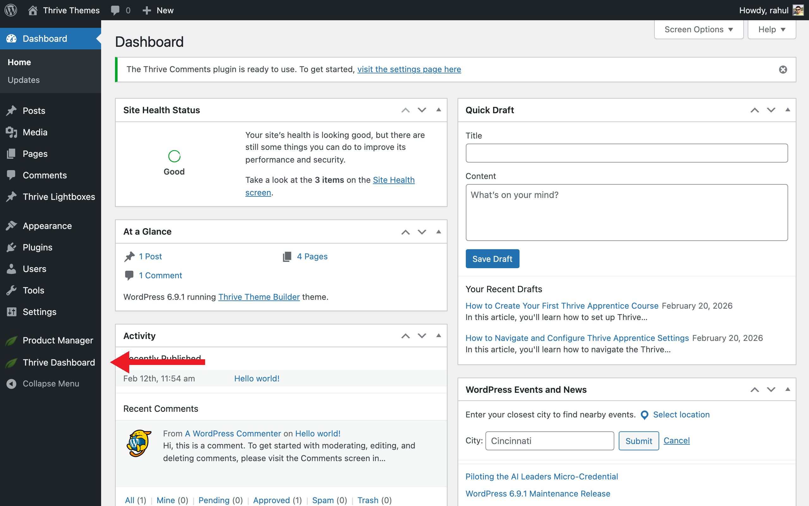

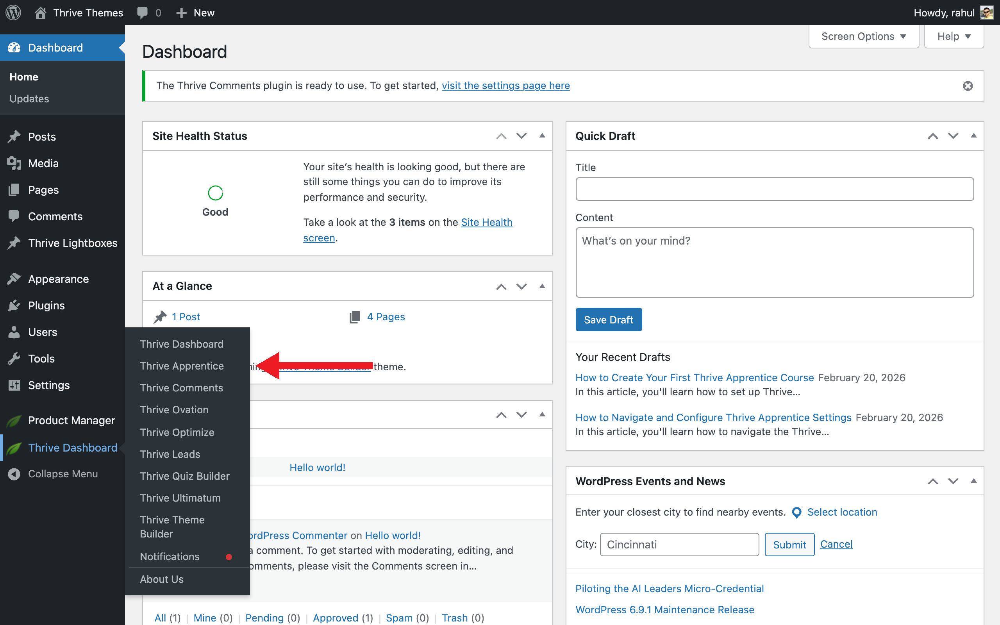

<!-- wp:paragraph -->
**Tip:** You can also access Thrive Apprentice by navigating to the **Thrive Dashboard** page and clicking the **Thrive Apprentice** card.
<!-- /wp:paragraph -->

<!-- wp:heading -->
## Running the Setup Wizard
<!-- /wp:heading -->

<!-- wp:paragraph -->
If this is your first time opening Thrive Apprentice, a setup wizard will appear automatically.
<!-- /wp:paragraph -->

<!-- wp:list {"ordered":true} -->
1. Click **Get Started** on the welcome lightbox.
2. Choose a page where your courses will be listed, or click **Add New Page** to create one. Then click **Continue**.
3. Enter a name for your school design (e.g., "My School") and click **Create new design**.
<!-- /wp:list -->

<!-- wp:paragraph -->
**Note:** The page you select (or create) becomes your main **Courses** page—the public-facing page where visitors can browse all available courses. The design you create controls the look and feel of your entire online school.
<!-- /wp:paragraph -->

<!-- wp:heading -->
## Creating Your First Course
<!-- /wp:heading -->

<!-- wp:paragraph -->
Once the setup wizard is complete, you'll land on the Thrive Apprentice dashboard.
<!-- /wp:paragraph -->

<!-- wp:list {"ordered":true} -->
1. Click the **Courses** tab in the left sidebar.
2. Click the **Add course** button at the top of the page.
3. Enter a **Course Title** (e.g., "Introduction to Email Marketing").
4. Optionally, add a **Course Description** to explain what students will learn.
5. Click **Save** to create the course.
<!-- /wp:list -->

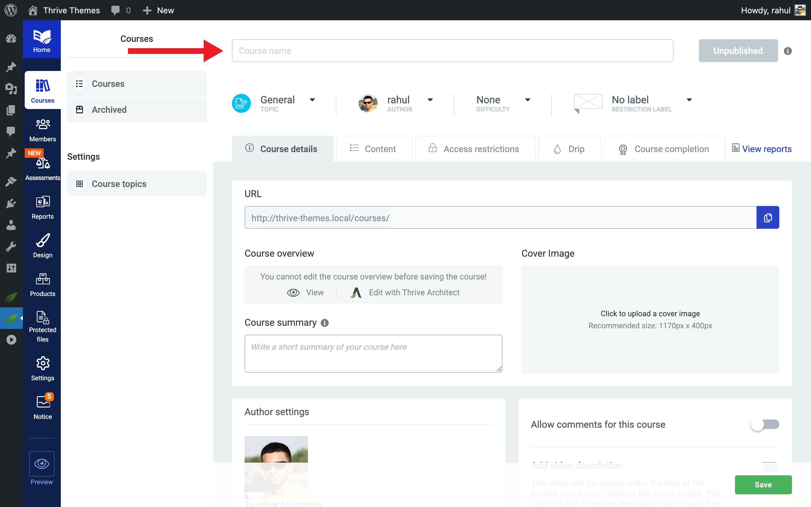

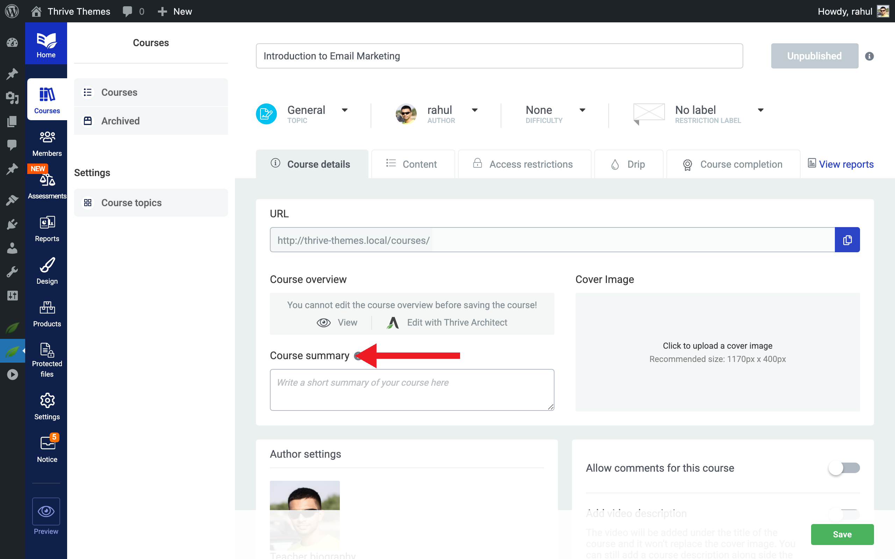

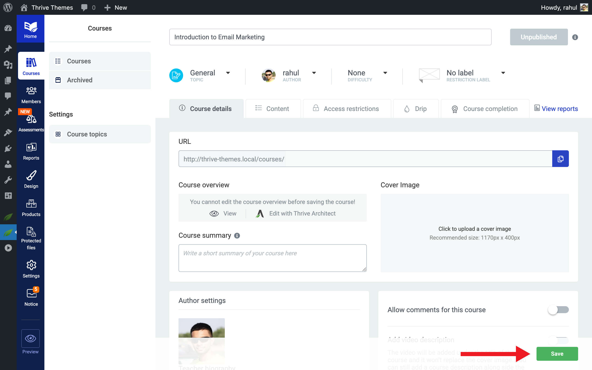

<!-- wp:paragraph -->
Your new course is now visible in the course list.
<!-- /wp:paragraph -->

<!-- wp:heading -->
## Adding Modules and Chapters
<!-- /wp:heading -->

<!-- wp:paragraph -->
Modules and chapters help you organize your course content into logical sections.
<!-- /wp:paragraph -->

<!-- wp:list {"ordered":true} -->
1. Open your course by clicking on it in the **Courses** list.
2. Click **Add Module** to create a top-level section (e.g., "Module 1: The Basics").
3. Enter a **Module Title** and click **Save**.
4. To add chapters within a module, click **Add Chapter** underneath the module.
<!-- /wp:list -->

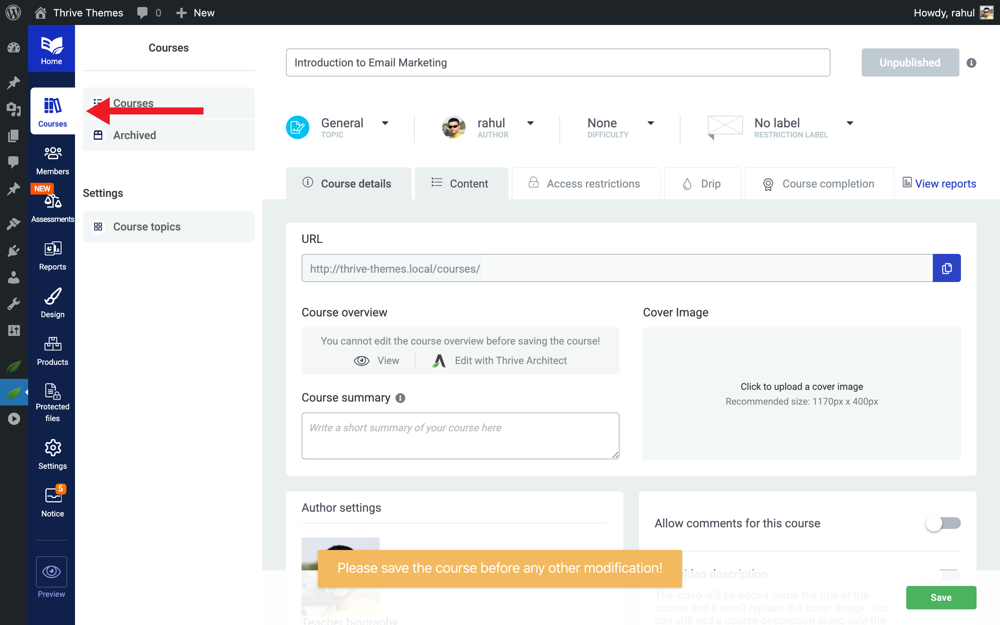

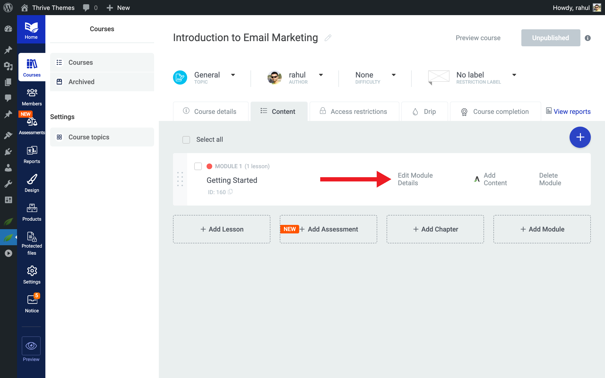

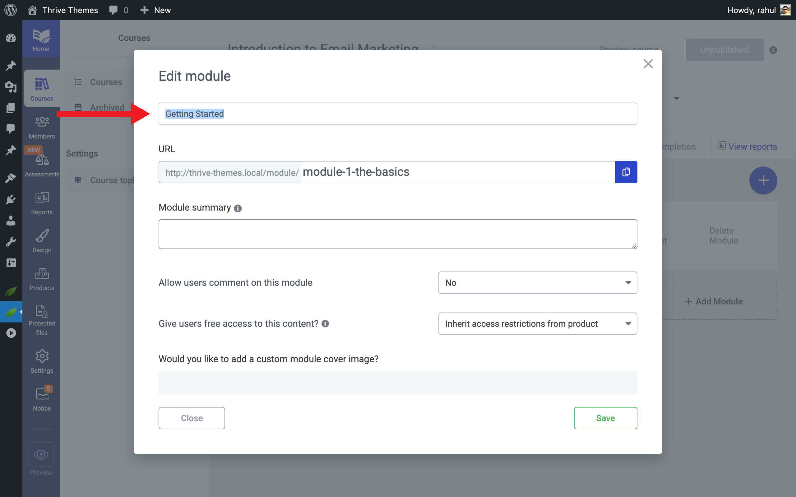

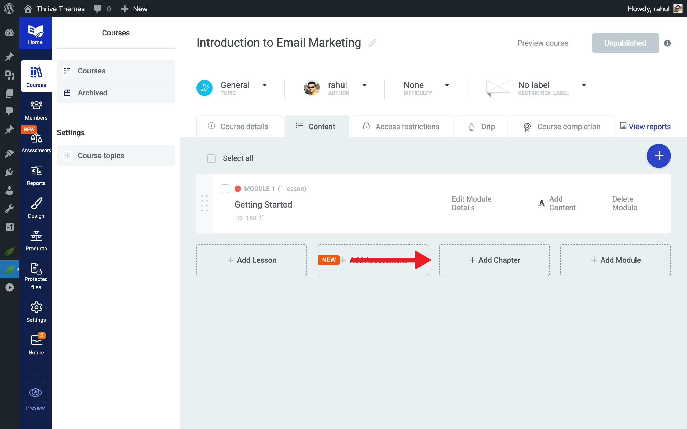

<!-- wp:paragraph -->
**Tip:** Modules are optional—you can add lessons directly to a course without modules if your content doesn't need that level of organization.
<!-- /wp:paragraph -->

<!-- wp:heading -->
## Adding Your First Lesson
<!-- /wp:heading -->

<!-- wp:list {"ordered":true} -->
1. Inside your course (or within a module), click **Add Lesson**.
2. Enter a **Lesson Title**.
3. Click **Save** to create the lesson.
4. To add content to the lesson, click **Add content**—this opens the lesson in **Thrive Architect**, where you can add text, images, videos, and other elements.
5. When you're done editing, click **Save Work** in Thrive Architect, then click **Done** to return to Thrive Apprentice.
<!-- /wp:list -->

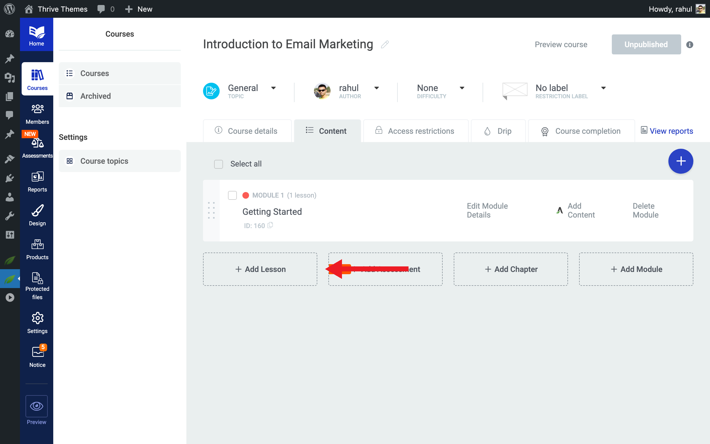

<!-- wp:heading -->
## Publishing Your Course
<!-- /wp:heading -->

<!-- wp:paragraph -->
By default, new courses are set to **Unpublished** status. To make your course available to students:
<!-- /wp:paragraph -->

<!-- wp:list {"ordered":true} -->
1. Go back to the **Courses** tab.
2. Click on **your course** to open it.
3. Click the **Unpublished** dropdown in the top-right corner and select **Publish**.
<!-- /wp:list -->

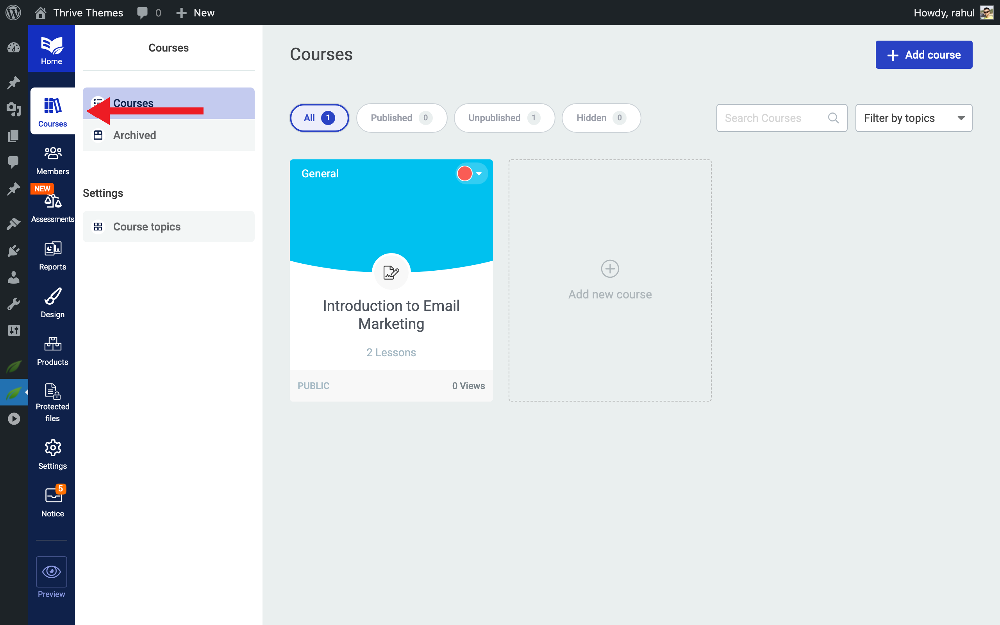

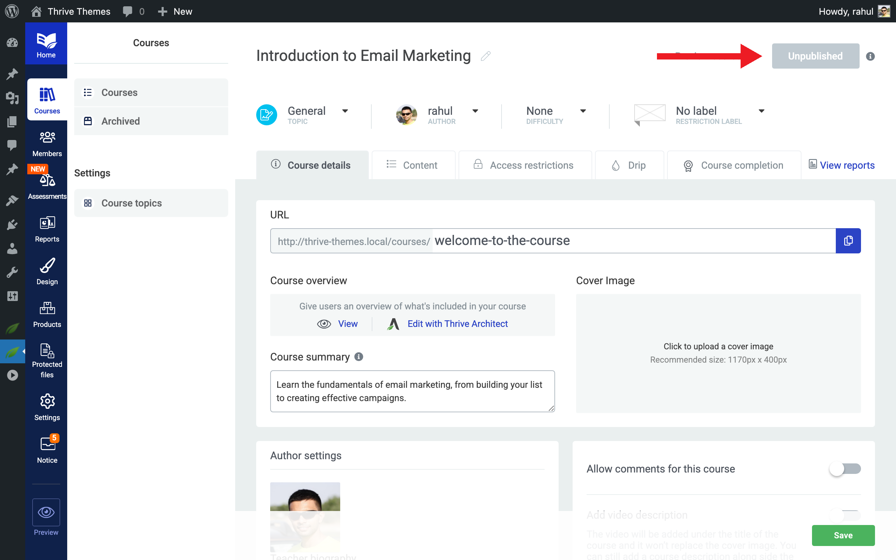

<!-- wp:paragraph -->
**Important:** Publishing a course makes it visible on your courses page. You must have at least one published lesson or assessment before a course can be published. If you want to restrict access (e.g., paid courses), set up a **Product** with access rules before publishing. See the [Access Restrictions and Rules guide](#) for details.
<!-- /wp:paragraph -->

<!-- wp:paragraph -->
That's it! You've successfully created your first Thrive Apprentice course, added modules and lessons, and published it for your students.
<!-- /wp:paragraph -->

<!-- wp:heading -->
## Related Resources
<!-- /wp:heading -->

<!-- wp:list -->
- **Thrive Apprentice Knowledge Base:** Explore the full [Thrive Apprentice Knowledge Base](https://thrivethemes.com/docs-categories/thrive-apprentice/) for more tutorials.
- **Course Content Types:** Learn about [course content types, navigation, structure, and progress tracking](#) to understand how courses are organized.
- **Course Bundles:** Learn how to [create course bundles](#) to package multiple courses together.
- **AI Course Generation:** Speed up course creation with [AI-powered course generation](#).
<!-- /wp:list -->
