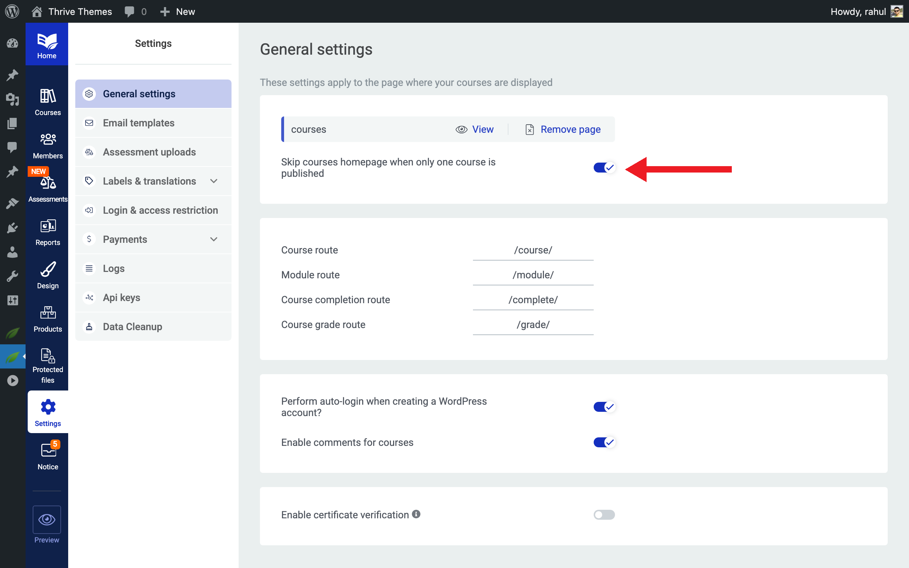
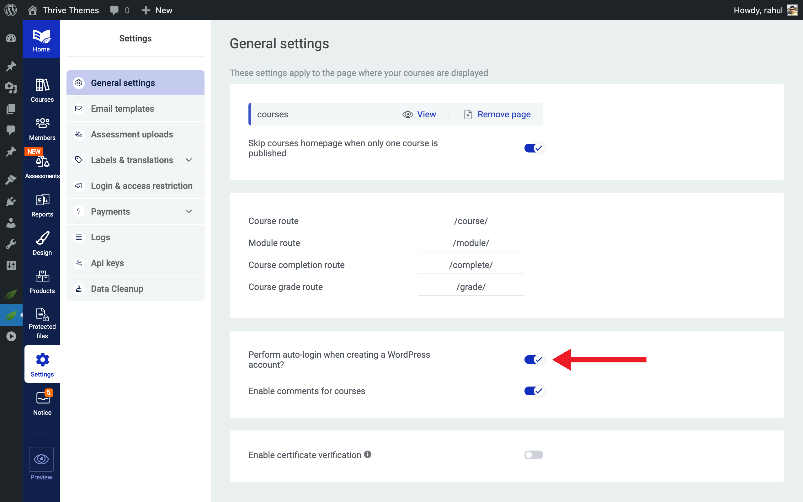
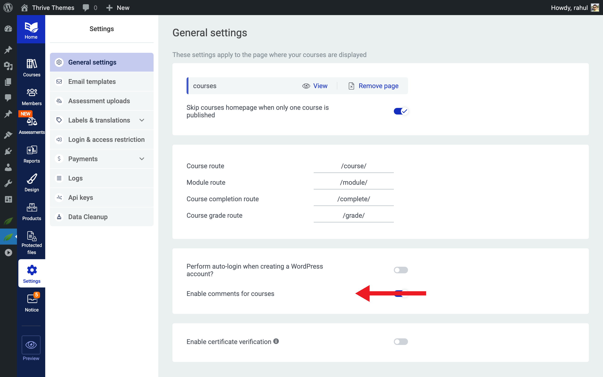
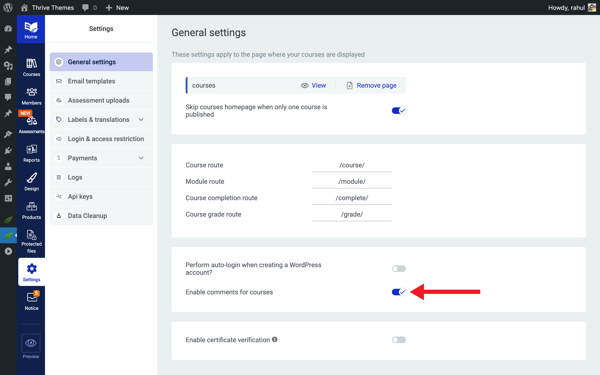
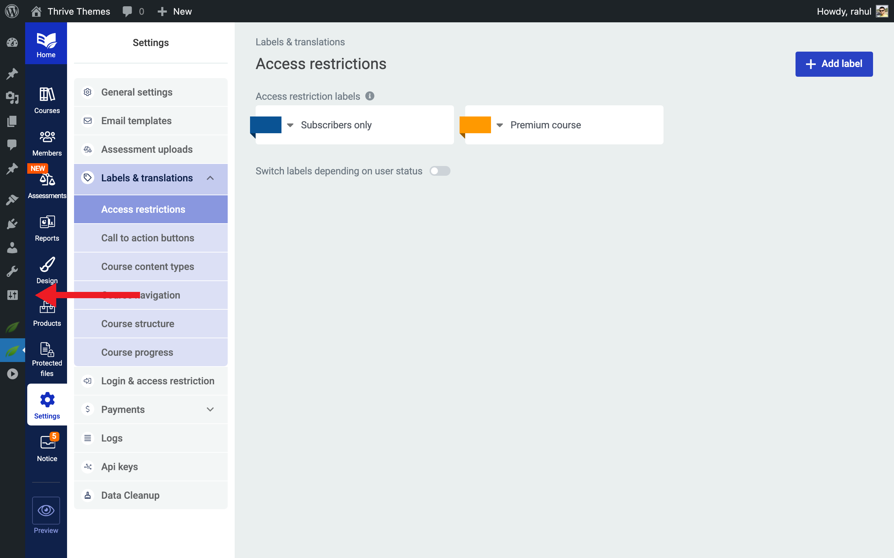
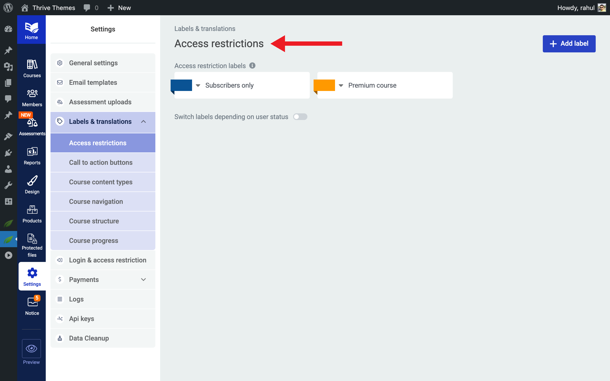

<!-- wp:heading {"level":1} -->
# How to Navigate and Configure Thrive Apprentice Settings
<!-- /wp:heading -->

<!-- wp:paragraph -->
In this article, you'll learn how to navigate the Thrive Apprentice **Settings** page, configure general settings for your online school, and customize dynamic labels to match your brand's voice.
<!-- /wp:paragraph -->

<!-- wp:heading -->
## Accessing the Settings Page
<!-- /wp:heading -->

<!-- wp:paragraph -->
To open the settings area, navigate to **Thrive Dashboard** > **Thrive Apprentice** and click **Settings** in the left sidebar. This takes you to a centralized hub where you can manage every aspect of your online school's configuration.
<!-- /wp:paragraph -->

<!-- wp:heading -->
## Understanding the Settings Page Layout
<!-- /wp:heading -->

<!-- wp:paragraph -->
The **Settings** page is organized into clearly labeled sections, each dedicated to a specific area of your Thrive Apprentice setup. You'll find the following tabs along the top or in the left-hand navigation:
<!-- /wp:paragraph -->

<!-- wp:list -->
- **General** — Core settings such as your course page, URL slugs, auto-login, and comment preferences.
- **Login & Access Restriction** — Controls for login pages, registration, and who can view your content.
- **Comments** — Enable or disable comments on courses, lessons, and modules.
- **Email Templates** — Customize automated emails sent to students upon enrollment, completion, and other events.
- **Assessment Uploads** — Manage settings for student assignment submissions.
- **Labels & Translations** — Adjust the default text and dynamic labels displayed throughout your courses.
<!-- /wp:list -->

<!-- wp:paragraph -->
**Tip:** You can jump directly to any section by clicking its name in the navigation. Each section saves independently, so you don't need to configure everything at once.
<!-- /wp:paragraph -->

<!-- wp:heading -->
## Configuring General Settings
<!-- /wp:heading -->

<!-- wp:paragraph -->
The **General** tab is where you set the foundational options for your online school. Here's what you can configure:
<!-- /wp:paragraph -->

<!-- wp:heading {"level":3} -->
### Course Page Selection
<!-- /wp:heading -->

<!-- wp:paragraph -->
Choose which WordPress page displays your Thrive Apprentice course catalog. This is the page visitors see when they browse all available courses on your site.
<!-- /wp:paragraph -->

<!-- wp:list {"ordered":true} -->
1. Open the **General** settings tab.
2. Locate the **Course Page** dropdown.
3. Select the page you want to use as your main course listing page.
4. Click **Save** to apply the change.
<!-- /wp:list -->

<!-- wp:heading {"level":3} -->
### URL Slugs
<!-- /wp:heading -->

<!-- wp:paragraph -->
Customize the URL structure for your courses, lessons, and modules. Clean, descriptive slugs improve both SEO and user experience.
<!-- /wp:paragraph -->

<!-- wp:list {"ordered":true} -->
1. Scroll to the **URL Slugs** section in the **General** tab.
2. Enter your preferred slug for each content type (e.g., `courses`, `lessons`).
3. Click **Save** to update the URLs.
<!-- /wp:list -->

<!-- wp:paragraph -->
**Important:** Changing URL slugs after your site is live may break existing links. If you update slugs, set up 301 redirects for any previously shared URLs.
<!-- /wp:paragraph -->

<!-- wp:heading {"level":3} -->
### Auto-Login
<!-- /wp:heading -->

<!-- wp:paragraph -->
When enabled, the **Auto-login** feature automatically logs users in when a new WordPress account is created for them. This provides a seamless experience for students who are added to your site through integrations or manual account creation.
<!-- /wp:paragraph -->

<!-- wp:list {"ordered":true} -->
1. In the **General** tab, find the **Auto-login** toggle.
2. Switch it **On** to enable automatic login for new accounts.
3. Click **Save**.
<!-- /wp:list -->

<!-- wp:heading {"level":3} -->
### Course Comments
<!-- /wp:heading -->

<!-- wp:paragraph -->
You can enable or disable comments on your course content directly from the **General** tab. This lets students ask questions and interact with your material.
<!-- /wp:paragraph -->

<!-- wp:list {"ordered":true} -->
1. Locate the **Enable Comments for Courses** option.
2. Toggle it **On** or **Off** based on your preference.
3. Click **Save**.
<!-- /wp:list -->

<!-- wp:heading -->
## Using Dynamic Labels
<!-- /wp:heading -->

<!-- wp:paragraph -->
Dynamic labels are adaptive text elements that automatically change based on the visitor's access status and context. For example, a label might display "Start Course" for a student with access and "Purchase Course" for someone who hasn't enrolled yet.
<!-- /wp:paragraph -->

<!-- wp:heading {"level":3} -->
### Where to Find Dynamic Labels
<!-- /wp:heading -->

<!-- wp:list {"ordered":true} -->
1. Go to **Settings** > **Labels & Translations**.
2. Select the **Access Restrictions** section.
3. You'll see a list of customizable labels and call-to-action buttons on the right side of the screen.
<!-- /wp:list -->

<!-- wp:heading {"level":3} -->
### Customizing Dynamic Labels
<!-- /wp:heading -->

<!-- wp:paragraph -->
Each label corresponds to a specific scenario—such as free access, paid enrollment, or restricted content. To customize a label:
<!-- /wp:paragraph -->

<!-- wp:list {"ordered":true} -->
1. Click on the label text you want to edit.
2. Type your new text in the field provided.
3. Repeat for any additional labels or call-to-action buttons.
4. Click **Save** to apply your changes.
<!-- /wp:list -->

<!-- wp:paragraph -->
Here are some common labels you can adjust:
<!-- /wp:paragraph -->

<!-- wp:list -->
- **Free course label** — Tells visitors the course is available at no cost.
- **Paid course label** — Indicates that a purchase or subscription is required.
- **Call-to-action button text** — The button text that prompts users to enroll, purchase, or log in.
- **Restricted content message** — The message shown when a visitor cannot access course material.
<!-- /wp:list -->

<!-- wp:paragraph -->
**Tip:** Use clear, action-oriented language in your labels. Instead of generic text like "Access," try something more specific like "Enroll Now—It's Free!" or "Unlock This Course."
<!-- /wp:paragraph -->

<!-- wp:heading -->
## Conclusion
<!-- /wp:heading -->

<!-- wp:paragraph -->
That's it! You've successfully learned how to navigate the Thrive Apprentice **Settings** page, configure your general settings, and customize dynamic labels. With these fundamentals in place, your online school is ready for further customization.
<!-- /wp:paragraph -->

<!-- wp:heading -->
## Related Resources
<!-- /wp:heading -->

<!-- wp:list -->
- **Login & access setup** — [How to Set Up Login, Registration, and Access Restrictions](2-02-login-registration-access.md)
- **Course management** — [How to Manage Course Status and Bulk Actions](2-03-managing-courses.md)
- **Member management** — [How to Manage Members in Thrive Apprentice](2-04-managing-members.md)
<!-- /wp:list -->
